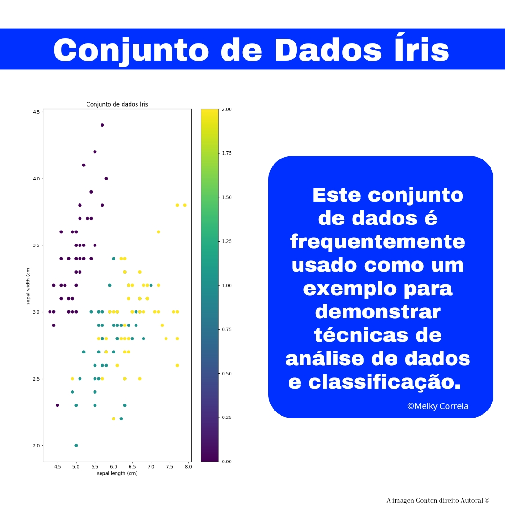

# Conjunto de dados Íris

O conjunto de dados Íris é um dos conjuntos de dados mais populares em ciência de dados e aprendizado de máquina. Ele contém informações sobre 150 flores de íris, divididas em três espécies diferentes: Iris setosa, Iris versicolor e Iris virginica. Cada flor tem quatro características medidas em centímetros: comprimento da sépala, largura da sépala, comprimento da pétala e largura da pétala.

# Este conjunto de dados é frequentemente usado como um exemplo para demonstrar técnicas de análise de dados e classificação.

# # Classificação de flores: 

Com base nas características medidas das flores, podemos treinar um modelo de aprendizado de máquina para prever a espécie de uma flor desconhecida. Isso é um exemplo de classificação de dados.

# # Visualização de dados:

Podemos usar as quatro características do conjunto de dados Íris para criar visualizações interessantes, como gráficos de dispersão e diagramas de caixa. Isso nos ajuda a entender melhor as relações entre as diferentes características e as espécies de íris.

# # Teste de algoritmos de aprendizado de máquina:

Como o conjunto de dados Iris é relativamente pequeno e bem compreendido, ele é frequentemente usado para testar algoritmos de aprendizado de máquina. Isso nos ajuda a entender como diferentes algoritmos de aprendizado de máquina funcionam e como eles podem ser ajustados para obter melhores resultados.

 
    

Em resumo, o conjunto de dados Iris é uma ferramenta valiosa para a comunidade de ciência de dados e aprendizado de máquina. Ele nos permite explorar técnicas de análise de dados e classificação em um conjunto de dados bem compreendido e interessante.

# Autor:

# Melky Correia

